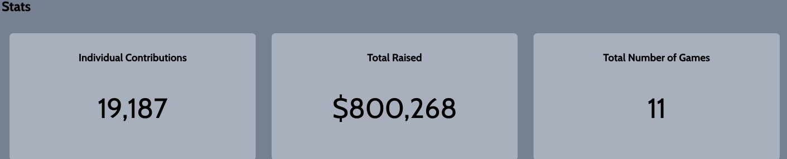
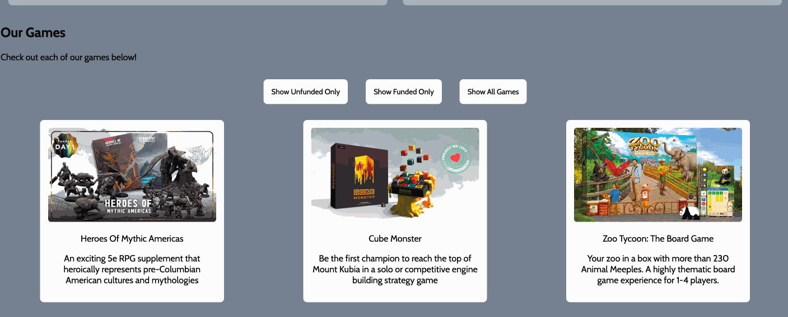
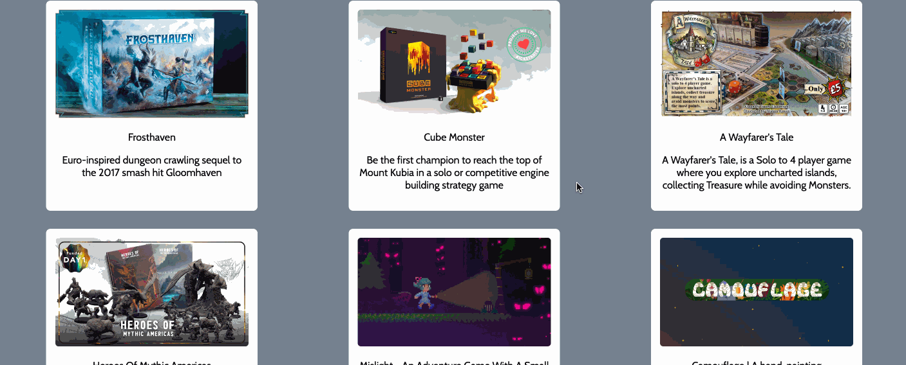
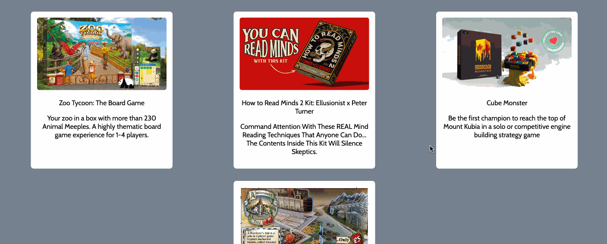
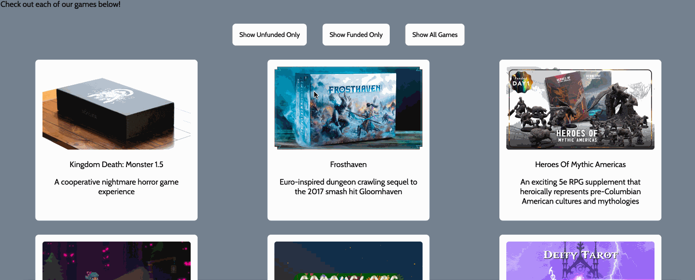

# WEB102 Prework - *Deep Sea Dominion*

Submitted by: Ayush Shah

Deep Sea Dominion is a website for the company Sea Monster Crowdfunding that displays information about the games they have funded.

Time spent: **6** hours spent in total

## Required Features

The following **required** functionality is completed:

* [X] The introduction section explains the background of the company and how many games remain unfunded.
* [X] The Stats section includes information about the total contributions and dollars raised as well as the top two most funded games.
* [X] The Our Games section initially displays all games funded by Sea Monster Crowdfunding
* [X] The Our Games section has three buttons that allow the user to display only unfunded games, only funded games, or all games.

The following **optional** features are implemented:

* [Added hover effects to buttons, Displayed the amount of funding for each of the top 2 games displayed ] List anything else that you can get done to improve the app functionality!

## Video Walkthrough

Here's a walkthrough of implemented features:

GIF created with LiceCap

## Notes

A challenge I encountered was thoroughly understanding template literals properly. Although I do have prior experience using them, it completely left my mind that they have to be enclosed by backticks, and that quotation marks don't work, but I was able to get around that hurdle after reading the description closely and referring to MDN Web Docs.

Another challenge I faced was understanding the notation for the spread operator and applying it properly in the index.js file. The spread operator reminded me of the power that JavaScript has in copying one object to produce another modified version of it. It makes your code much more efficient and easy to use rather. As someone who has often used a for loop copying certain array elements, I was glad to remember and get familiar again with the spread operator.

## License

    Copyright 2024 Ayush Shah

    Licensed under the Apache License, Version 2.0 (the "License");
    you may not use this file except in compliance with the License.
    You may obtain a copy of the License at

        http://www.apache.org/licenses/LICENSE-2.0

    Unless required by applicable law or agreed to in writing, software
    distributed under the License is distributed on an "AS IS" BASIS,
    WITHOUT WARRANTIES OR CONDITIONS OF ANY KIND, either express or implied.
    See the License for the specific language governing permissions and
    limitations under the License.
